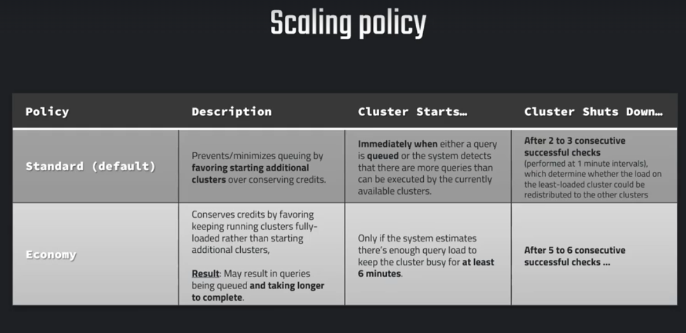
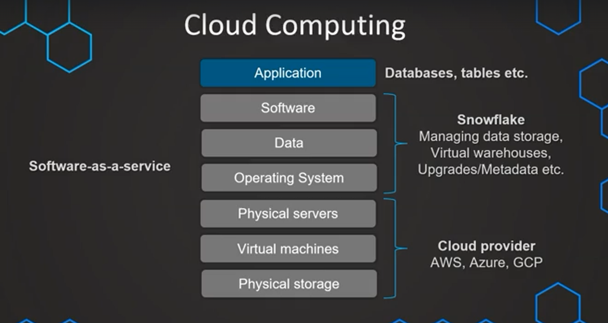
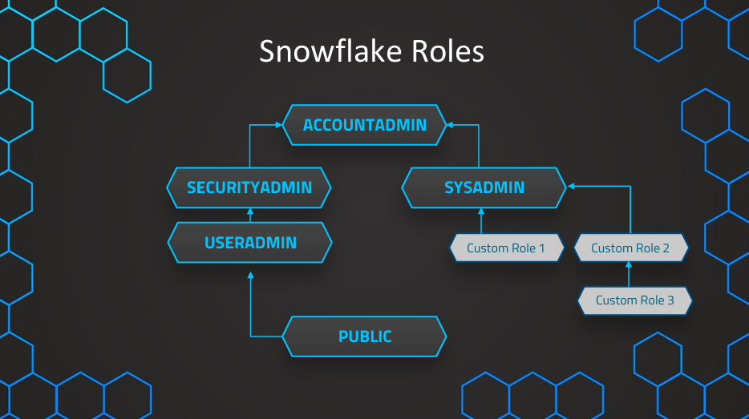
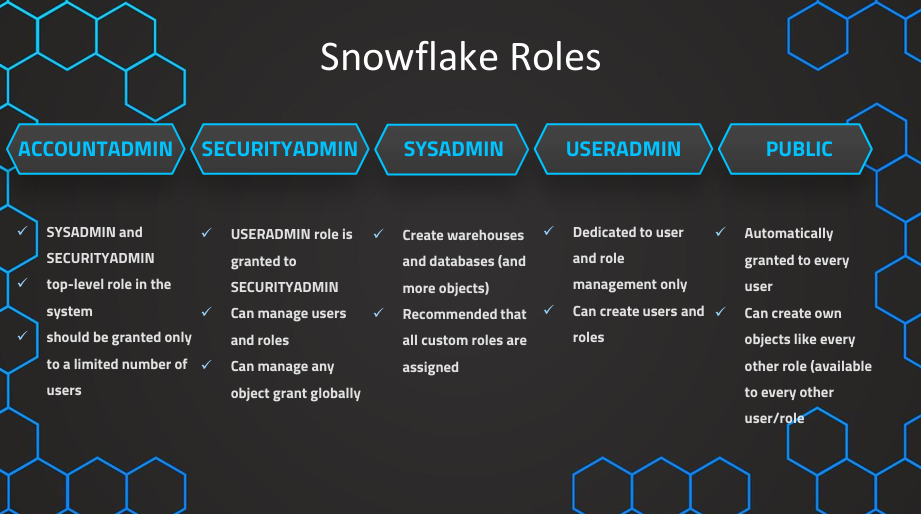
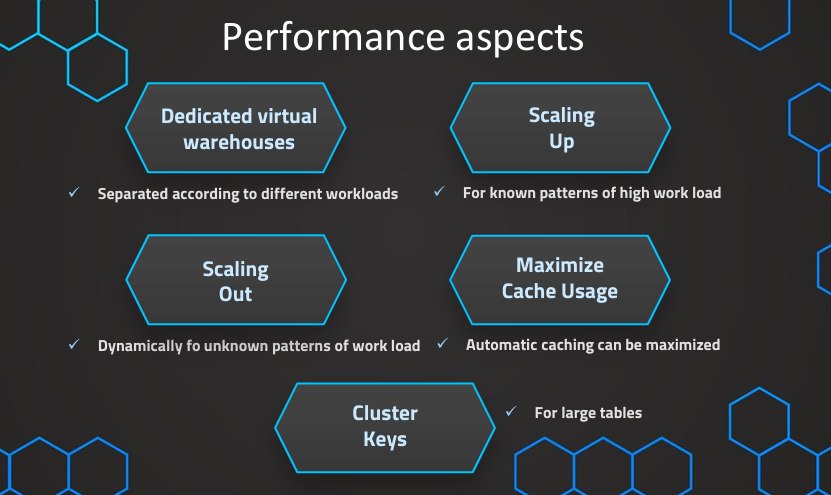

<h1>Overview</h1>

Repository to record learning of Snowflake

<h2>Notes</h2>

1. <strong>Snowflake Architecture</strong>  
    Snowflake has 3 layers:  
    &emsp;a. <strong>Storage layer</strong>: Based on our selection during signup, 
    it will be stored in either AWS, DCP or Azure.  
    This is where all the data resides.  
    It is stored in Hybrid Columnar Storage i.e. column wise + compressed Blob.  
    When we query the data, we access the compressed Blobs instead of rows.  
    &emsp;b. <strong>Query Processing/ Processing layer</strong>: This is where queries are processed, 
    using Warehouses(Virtual Compute Resources).  
    Performs MPP(Massive Parallel Processing).  
    Called Muscle of the system.  
    &emsp;c. <strong>Cloud Services layer</strong>: Called the brain of the system.  
    Managing infrastructure, Access control security, Optimizer, Metadata etc.   
2. <strong>Warehouse Sizing and Pricing</strong>  
   Warehouse sizing goes from XS(1 Server and 1 credit/hour) to 4XL(128 Server).  
   The number of server doubles with every t-shirt size increase.  
   Credits are charged per second basis of query execution/ warehouse usage.  
   Currency is converted to Credits and conversion value depends on region, provider etc.   
3. <strong>Multi-Clustering</strong>
    Multiple warehouses of same t-shirt size to create cluster to run multi queries without queuing.  
    This is used during peak hours when we have multiple users using same warehouse thus we have multiple queries.  
    It is not suitable when our queries are complex and taking long time.  
    Multi-clustering option is selected when creating a warehouse,  
    &emsp;a. During creation, we can mention if we want multi-clustering to be enabled.  
    &emsp;b. What is the min and max number of cluster we want to run  
    &emsp;c. What is the policy of scaling  
    &emsp;&emsp;i. When cluster is full then spin up new cluster (Cost optimizing).  
    &emsp;&emsp;ii. Prevent/ Minimize queuing of queries (Performance optimizer).   
4. <strong>Warehouse creation</strong>  
    The two roles which have permission to create warehouses are:  
    &emsp;a. AccountAdmin  
    &emsp;b. SysAdmin  
    <strong>To create a warehouse:</strong>  
    &emsp;a.Using UI  
    &emsp;&emsp;i. Go to Admin > Warehouses > +Warehouse  
    &emsp;&emsp;ii. Select details and click Create Warehouse  
    &emsp;b.Using SQL commands in worksheet  
    &emsp;&emsp;See ./sql/01_creating_warehouses.sql 
    <em>Note: We have some defaults set hence we need not provide information about all the parameters.  
    &emsp;&emsp;&emsp;We do not need warehouse to execute warehouse related commands as it is done by Cloud service layer.</em>  
    <strong>See details about warehouse using UI:</strong>  
    &emsp;a. select the warehouse after selecting a role  
    &emsp;b. Click on list icon above warehouse list in UI   
5. <strong>Managing warehouses</strong>  
    a. To resume and suspend warehouse  
    &emsp; ALTER WAREHOUSE [warehouseName] RESUME;  
    &emsp; ALTER WAREHOUSE [warehouseName] SUSPEND;  
    b. To set new value for existing warehouse  
    &emsp;ALTER WAREHOUSE [warehouseName] SET [attribute]=[value];  
    c. To drop a warehouse  
    &emsp; DROP WAREHOUSE [warehouseName];  
    <em>See ./sql/02_managing_warehouses.sql</em>  
    <em>Note: We can also alter, drop, resume and suspend warehouse from Admin > Warehouses section of UI</em>   
6. <strong>Scaling policies for multi-clustering</strong>  
   
7. <strong>Creating Databases</strong>  
    The two roles which have permission to create databases are:  
    &emsp;a. AccountAdmin  
    &emsp;b. SysAdmin  
    <strong>To create a database:</strong>  
    &emsp;a.Using UI  
    &emsp;&emsp;i. Go to Data > Databases > +Database  
    &emsp;&emsp;ii. Select details and click Create  
    &emsp;b.Using SQL commands in worksheet  
    &emsp;&emsp;<em>See ./sql/03_creating_and_managing_databases.sql</em>   
8. <strong>Creating Table and Loading Data</strong>  
   <em>See ./sql/04_loading_data_into_table.sql</em>   
9. <strong>What is purpose of Data Warehouse?</strong>  
    To integrate different data sources and use them for reporting and data analysis.  
    These data can be of different formats, structured or unstructured etc.  
    We can perform analysis on each individual database but that would put unnecessary load on the databases.  
    We load data from different sources into warehouse using ETL process  
    &emsp; E - Extract: Staging Layer is for loading data into warehouse in raw format, 
        so that we spend minimum time on production database  
    &emsp; T - Transform: Data Integration layer is where we transform 
        and establish relations between different data sources.  
    &emsp; L - Load: Access Layer is from where Reporting team, or BI team can access data from once loaded.   
10. <strong>Cloud Computing in Snowflake architecture</strong>  
   
11. <strong>Pricing in Snowflake</strong>  
    The pricing are decoupled into two parts:  
    &emsp;a. Storage  
    &emsp;b. Compute  
    The pricing of each part depends on region/cloud provider etc.  
    Additionally, we can incur Data Transfer costs if applicable.  
    Additionally, we can also be charged for Cloud Services if they exceed 10% of warehouse consumption.  
    We also have to select between on-demand and provisioned storage which is charged on per month basis.   
12. <strong>Cost Management</strong>  
    We can see the cost in Snowflake UI using Account > Cost management and only AccountAdmin can access it.  
    To calculate the cost, Snowflake uses one of our warehouse hence the default warehouse resumes.  
    Apart from our created warehouses, we have CLOUD_SERVICE_ONLY warehouse.  
    This warehouse is used to execute Cloud Service related queries only and is not available for use in general cases.  
    <strong>Resource Monitors</strong>  
    &emsp;a. We can use resource monitor to set up quota on account or warehouse level.  
    &emsp;b. We can also set up different levels of quota and actions to take like:  
    &emsp;&emsp;i. Notify if x% of quota is reached  
    &emsp;&emsp;ii. Suspend warehouse(after current query execution completes) and Notify if x% of quota is reached  
    &emsp;&emsp;iii. Suspend warehouse(cancel all query execution) and Notify if x% of quota is reached   
13. <strong>Roles</strong>  
  
   
14. <strong>Loading Data </strong>  
    We can load data into snowflake in two manner:  
    &emsp;a. Bulk loading: Most frequent method using warehouses and loading from stages.  
    &emsp;&emsp;We can use COPY command along with transformations.  
    &emsp;b. Continuous loading: Designed to load small volume of data automatically when they are added to stages.  
    &emsp;&emsp;Provides us with latest data and uses Snowpipe (Serverless feature).   
15. <strong>Stages</strong>  
    It is different from data warehouse stages. It is location of data files from where data can be loaded.  
    It has details like URL, URI or PATH of location along with credentials and other required fields.  
    It can be of 2 types:  
    &emsp;a. External Stage: Database object created in Schema which is in External cloud provider like AWS, GCD, Azure, etc.  
    &emsp;&emsp; Created using CREATE STAGE(URL, access settings) command.  
    &emsp;&emsp;These may have additional cost if region/ platform(platform selected during signup) differs.   
    &emsp;b. Internal Stage: Local storage maintained by Snowflake (Not used in general)  
    <em>See ./sql/05_creating_stages.sql for example on creating and listing files in external stage</em>  
    When external stages are used in Snowflake, we use @ before stage name.  
    We need not use @ before stage name when we create or replace or alter the stage.  
    <em>See ./sql/06_COPY_command.sql for example on loading data from external stage</em>  
    <em>Note: to unload data from Snowflake to External storage, use COPY INTO command with following syntax  
    &emsp;COPY INTO @[stageName] FROM [tableName]</em>   
16. <strong>COPY command with Transforming Data</strong>  
    <em>See ./sql/07_COPY_command_with_transformations.sql</em>   
17. <strong>COPY command with error handling</strong>  
    We have different options when an error occurs while loading the data from files.  
    The default is ABORT_STATEMENT which will exit the execution as soon as error is encountered and no data is loaded.  
    We also have options to SKIP_FILE, CONTINUE, SKIP_FILE_[errorLimitAbsolute/ errorLimitPercentage].  
    <em>See ./sql/08_COPY_command_with_error_handling.sql</em>   
18. <strong>File Format</strong>  
    These are Database Schema objects that are used to define different properties of files to be used when referred.  
    Once a file format type is defined while creating, it cannot be changed, hence, its associated properties also.  
    Other properties apart from type can be altered using alter command.  
    All options that are available in file format object are also available under stage object as sub-attribute.  
    <em>See ./sql/09_file_format.sql</em>  
    <em>Note: file_format attribute in COPY command overrides the options in FILE FORMAT object if both are used.</em>   
19. <strong>Options in COPY Command</strong>  
    &emsp;a. <strong>VALIDATION_MODE:</strong> When we use this option, data is not loaded and we only run validation.  
    &emsp;&emsp;If we set the VALIDATION_MODE to RETURN_ERROR, then all errors after validation are returned.  
    &emsp;&emsp;If we set the VALIDATION_MODE to RETURN_n_ROWS, then first n rows are validated and returned if no error.  
    &emsp;<em>See ./sql/10_validation_mode_in_copy_command.sql</em>  
    &emsp;<em>See ./sql/11_storing_rejected_records_for_reference.sql for options for storing rejected records.</em>  
    &emsp;b. <strong>SIZE_LIMIT:</strong> Maximum size(in bytes) of data loaded in that command(at least one file loaded).  
    &emsp;&emsp;When the threshold is exceeded, the COPY operation stops loading next file(s).  
    &emsp;<em>See ./sql/12_size_limit_in_copy_command.sql</em>  
    &emsp;c. <strong>RETURN_FAILED_ONLY:</strong> Return as result only those files that are partially loaded.  
    &emsp;&emsp;It is used in combination with ON_ERROR=CONTINUE or SKIP_FILE or SKIP_FILE_n.  
    &emsp;<em>See ./sql/13_return_failed_only_in_copy_command.sql</em>  
    &emsp;d. <strong>TRUNCATECOLUMNS:</strong> Truncate string value if length of string value for the column exceed limit.  
    &emsp;&emsp;If set to true, data is loaded with truncation else query is aborted/ row skipped as per our preference  
    &emsp;<em>See ./sql/14_truncatecolumn_in_copy_command.sql</em>  
    &emsp;e. <strong>FORCE:</strong> Load data from file even if it is already loaded and has not changed.  
    &emsp;&emsp;It can lead to duplicate entries if set to true and also additional cost.  
    &emsp;<em>See ./sql/15_force_in_copy_command.sql</em>  
    <strong>Load History:</strong> The history related to COPY into command executed for each table is stored in a table.  
    &emsp;The SNOWFLAKE DB has history even if table was deleted and recreated while local DB has history for current table only.  
    <em>See ./sql/16_load_history_for_copy_command.sql</em>   
20. <strong>Loading Unstructured Data</strong>  
    &emsp;a. <strong>JSON</strong>  
    &emsp;&emsp;i. Loading raw data: <em>See ./sql/17_load_raw_json.sql</em>  
    &emsp;&emsp;ii. Parsing JSON raw data: <em>See ./sql/18_parsing_json_data.sql</em>  
    &emsp;&emsp;iii. Flatten hierarchical data: <em>See ./sql/19_flatten_hierarchical_data.sql</em>  
    &emsp;<em>To insert data into table for new or pre-defined table, See ./sql/20_insert_into_table.sql</em>  
    &emsp;b. <strong>Parquet</strong>  
    &emsp;&emsp;<em>See ./sql/21_loading_parquet_data_from_stage.sql</em>   
21. <strong>Performance Optimization</strong>  
      
    &emsp;a. Dedicated Warehouse: <em>See ./sql/22_create_dedicated_warehouse_role_and_user.sql</em>  
    &emsp;b. Scaling up/down: We can alter the warehouse size using SQl ALTER command or UI.  
    &emsp;&emsp;It depends on how complex our queries are, not on how many queries we are executing/ user being handled.  
    &emsp;c. Scaling out/in: Used to handle large number of concurrent users. Can also handle fluctuating number of users.  
    &emsp;&emsp;Multi-custer features are available in Enterprise editions or above.  
    &emsp;&emsp;It is always recommended to have multi-cluster warehouses with min size as 1 as it has no down-side.  
    &emsp;d. Caching: It is automatically enabled by default. If a query is executed twice, results are cached and re-used.  
    &emsp;&emsp;Results are cached for 24 hours or until the underlying data has changed.  
    &emsp;&emsp;We should ensure similar queries are run on same warehouse to get maximum benefit of caching.  
    &emsp;e. Clustering: Snowflake automatically maintains the clustering keys and is pretty good at it.  
    &emsp;&emsp;In certain cases we can specify our own clustering key or expression which will be more suitable.  
    &emsp;&emsp;We cluster on basically expression or column which is mostly used in our WHERE clause or JOIN.  
    &emsp;&emsp;Syntax for defining custom clustering key or altering, deleting cluster key:  
    &emsp;&emsp;&emsp;i. CREATE TABLE <name> ... CLUSTER BY ( <column1> [ , <column2> ... ] )  
    &emsp;&emsp;&emsp;ii. CREATE TABLE <name> ... CLUSTER BY ( <expression> )  
    &emsp;&emsp;&emsp;iii. ALTER TABLE <name> CLUSTER BY ( <expr1> [ , <expr2> ... ] )  
    &emsp;&emsp;&emsp;iv. ALTER TABLE <name> DROP CLUSTERING KE  
    &emsp;&emsp; <em>See ./sql/23_clustering.sql</em>   
